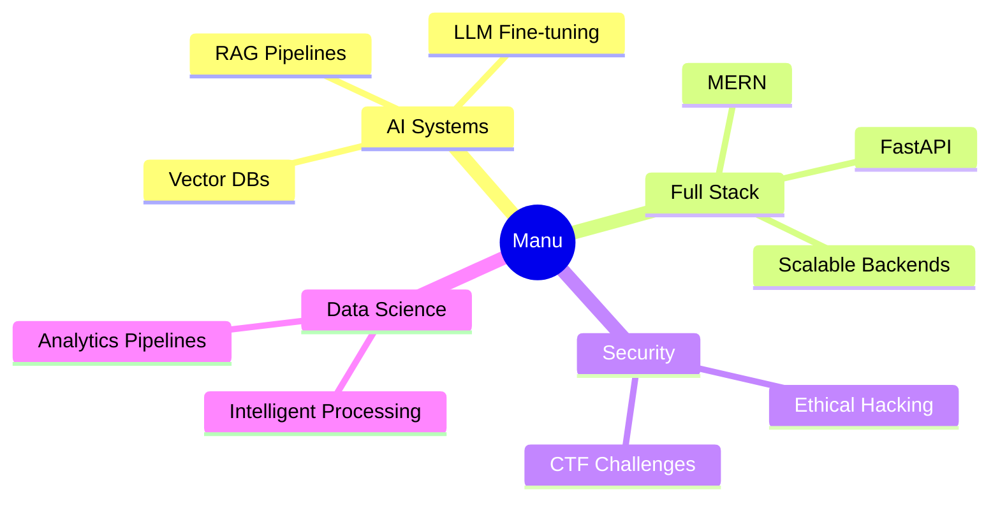

<div align="center">

<!-- Animated header banner -->


<!-- Typing animation with multiple roles -->
[](https://git.io/typing-svg)

<br/>

<!-- Social + contact badges -->
[](https://linkedin.com/in/YOUR_ID)
[](mailto:YOUR_EMAIL)
[](https://your-portfolio.vercel.app)
[](https://github.com/Manu080405)

<br/><br/>


</div>
<!-- Terminal-style whoami -->
```bash
╔══════════════════════════════════════════════════════╗
║  $ whoami                                            ║
╠══════════════════════════════════════════════════════╣
║                                                      ║
║  > Name     : Manu                                   ║
║  > Degree   : B.Tech CS (Data Science) — Year 3     ║
║  > Location : India 🇮🇳                              ║
║  > Focus    : AI Systems · Full Stack · Backend      ║
║  > Status   : [████████░░] Building...               ║
║                                                      ║
║  $ cat interests.txt                                 ║
║  AI/ML · RAG Pipelines · Legal Tech · Cybersec      ║
║  Scalable Backends · Open Source · Problem Solving   ║
║                                                      ║
║  $ echo $CURRENT_VIBE                                ║
║  "Turning complex domains into smart software"       ║
╚══════════════════════════════════════════════════════╝
```

<br/>

<!-- Skill progress bars using custom image service -->
<div align="center">

| Skill | Level |
|---|---|
| Python | `[████████████████████] 90%` |
| MERN Stack | `[██████████████████░░] 85%` |
| FastAPI + RAG | `[████████████████░░░░] 80%` |
| Data Science | `[███████████████░░░░░] 75%` |
| C Programming | `[████████████░░░░░░░░] 65%` |
| Cybersecurity | `[████████░░░░░░░░░░░░] 45%` |

</div>

<br/>

<!-- Coding activity / joke widget row -->
<div align="center">


</div>

<br/>

> ⚡ **Fun fact:** I build AI for domains that never had it — legal research, security analysis, and data intelligence. Currently obsessed with RAG architectures and making LLMs actually useful.
## 🚀 What I've Built

<div align="center">

<table>
<tr>
<td width="50%" valign="top">

### ⚖️ LEXAI — AI Legal Research


An AI-powered legal analysis platform performing **semantic search** across 358+ BNS sections using vector embeddings.

**Stack:**


```
Architecture:
  Query → Embedding → FAISS Search
  → LLM Rerank → Legal Summary
```

- 🔍 358+ BNS sections indexed
- ⚡ Sub-second semantic retrieval
- 🤖 LLM-powered summaries

</td>
<td width="50%" valign="top">

### 🛍️ E-Commerce Platform


Full-stack production e-commerce app with JWT auth, role-based access, and real-time admin dashboard.

**Stack:**


```
Features:
  JWT Auth → RBAC → Admin Panel
  → Product CRUD → Order Flow
```

- 🔐 JWT + role-based auth
- 📊 Admin dashboard
- 🛒 Full order management

</td>
</tr>
</table>

</div>

---

## 🔭 Currently Exploring

<div align="center">



</div>
## 🛠️ Tech Arsenal

<div align="center">

**Languages**


**AI / ML / Data**


**Full Stack**


**Tools & DevOps**


</div>

---

## 🤝 Let's Collaborate

<div align="center">

I'm actively looking for collabs on:

[]()
[]()
[]()
[]()

</div>
## 📊 GitHub Stats

<div align="center">


</div>

<div align="center">


</div>

<br/>

<!-- GitHub Trophies -->
<div align="center">

[](https://github.com/ryo-ma/github-profile-trophy)

</div>

<br/>

<!-- Activity Graph -->
[](https://github.com/ashutosh00710/github-readme-activity-graph)

<br/>

<!-- 3D Contribution chart -->
<div align="center">

[](https://github.com/Manu080405)

<small>↑ Set this up: <a href="https://github.com/yoshi389111/github-profile-3d-contrib">github-profile-3d-contrib</a></small>

</div>
---

## 🐍 Contribution Snake

<div align="center">


</div>

---

<div align="center">

<!-- Random dev quote -->


<br/>

[](https://visitcount.itsvg.in)

<br/>

<!-- Footer wave matching header -->


</div>
